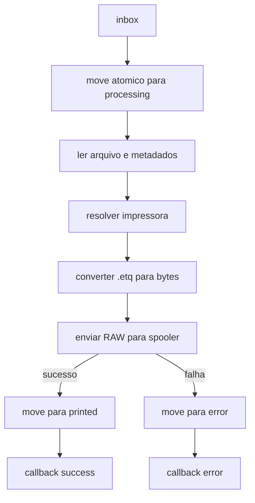

# Hardness Print Bridge

<div align="center">

### Microserviço Windows para impressão automática de etiquetas `.etq` via RAW spooler

[](#status-atual)
[](#)
[](#fluxo-operacional)
[](#contrato-de-callback-mvp)

</div>

---

## Visão Rápida

`Hardness Print Bridge` é a ponte entre o Hardness e as impressoras instaladas no cliente, sem depender de navegador.

Ele processa jobs por pasta monitorada, imprime em RAW e separa claramente sucesso de erro:

`inbox -> processing -> printed/error`

## Highlights do MVP

- Impressão automática local em **Windows Service**.
- Suporte ao formato atual `.etq` (bytes numéricos separados por espaço).
- Roteamento por impressora solicitada ou padrão.
- Falha explícita para impressora inválida/offline (sem fallback silencioso).
- Callback HTTP para devolutiva de status ao Hardness.
- Log operacional com rastreabilidade por arquivo.

## Arquitetura

| Bloco | Responsabilidade |
|---|---|
| Entrada de jobs | Lê arquivos da fila (`inbox`) em pasta local/compartilhada |
| Orquestração | Move job para `processing`, valida e controla idempotência |
| Domínio de impressão | Converte `.etq` -> `byte[]` e envia RAW para spooler Windows |
| Resultado | Move para `printed` ou `error` |
| Integração Hardness | Envia callback `success/error` com metadados do processamento |
| Observabilidade | Logs por job + health logs de ciclo |

## Estrutura de Diretórios (Cliente)

```txt
C:\hardness\print-agent\
├─ inbox\
├─ processing\
├─ printed\
├─ error\
├─ logs\
└─ meta\        (opcional no MVP)
```

## Fluxo Operacional



## Regras Críticas de Consistência

- Nunca imprimir direto da `inbox`.
- Sempre mover para `processing` antes de processar.
- Não apagar arquivo em caso de erro.
- Idempotência por nome de arquivo.
- Se impressora solicitada falhar, marcar erro (sem fallback automático para padrão).

## Configuração Mínima

Use `.env` ou `appsettings.json` com as chaves abaixo:

```env
watch_path=
processing_path=
printed_path=
error_path=
default_printer_name=
poll_interval_ms=2000
log_level=Information
hardness_callback_url=
hardness_callback_token=
```

## Contrato de Callback (MVP)

Payload mínimo recomendado:

```json
{
  "file_name": "pedido_123.etq",
  "status": "success",
  "requested_printer": "Zebra-GX430",
  "used_printer": "Zebra-GX430",
  "error_message": null
}
```

## Critérios de Aceite

| Cenário | Resultado esperado |
|---|---|
| `.etq` válido sem impressora especificada | Imprime na padrão e vai para `printed` |
| `.etq` válido com impressora existente | Imprime na solicitada e vai para `printed` |
| Impressora inexistente/offline | Vai para `error` + callback de falha |
| `.etq` inválido | Vai para `error` + log + callback |
| Reinício do serviço | Sem perda de jobs pendentes |
| Inicialização do SO | Serviço sobe com Windows |

## Roadmap Técnico

- [ ] Fase 0: base do projeto, config e bootstrap.
- [ ] Fase 1: núcleo da fila (`inbox -> processing -> printed/error`).
- [ ] Fase 2: parser `.etq`, resolvedor de impressora e RAW spooler.
- [ ] Fase 3: callback HTTP com retry simples.
- [ ] Fase 4: resiliência de restart e health logs.
- [ ] Fase 5: empacotamento e scripts de Windows Service.
- [ ] Fase 6: testes de aceite ponta a ponta.

Backlog completo: [backlog.md](./backlog.md)

## Fora de Escopo (MVP)

- Painel web administrativo.
- API pública para entrada de jobs via HTTP.
- Reprocessamento automático com política avançada.

## Status Atual

Projeto em fase de definição e planejamento técnico do MVP.

Referências de produto e execução:
- [mvp_servico_impressao.md](./mvp_servico_impressao.md)
- [backlog.md](./backlog.md)

---

## Próximo Passo Imediato

Implementar o esqueleto do serviço com:
1. watcher de arquivos,
2. movimentação atômica da fila,
3. parser `.etq`,
4. impressão RAW,
5. callback HTTP.
